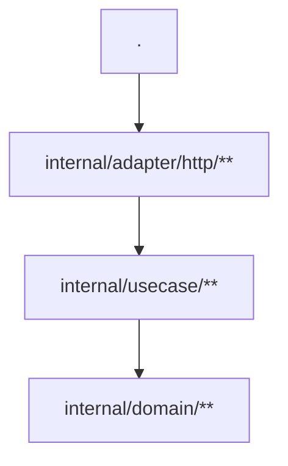

# Contributing

## Quick start

```
go build -o baft .
./baft check /path/to/repo
./baft draft /path/to/repo
go test ./...
```

## Architecture

Baft follows a hexagonal (ports and adapters) architecture:

```
baft/
├── main.go                                          # CLI: subcommands, version, reporters
├── go.mod                                           # Zero external dependencies
├── pkg/treeview/                                    # Public utility: tree view rendering
└── internal/
    ├── port/                                        # Interfaces (ports)
    │   ├── language.go                              # Language, CapsuleDiscovery, Capsule, ImportSpec
    │   ├── fs.go                                    # FileSystem interface
    │   ├── graph_repository.go                      # GraphRepository interface
    │   └── reporter.go                              # CheckResult, Violation, CheckResultRenderer
    ├── domain/graph/                                # Core domain logic
    │   └── graph.go                                 # Graph, globs, node/edge matching
    ├── application/
    │   ├── service/
    │   │   ├── discovery.go                         # CapsuleDiscovery (two-phase manifest walk)
    │   │   └── capsule.go                           # Capsule walking utilities
    │   └── usecase/
    │       ├── check/check.go                       # `baft check` — validates architecture
    │       └── draft/draft.go                       # `baft draft` — generates BAFT.md
    └── adapter/
        ├── languages/                               # Language adapters (adapters)
        │   ├── golang/golang.go
        │   ├── dart/dart.go
        │   ├── typescript/typescript.go
        │   ├── kotlin/kotlin.go
        │   └── rust/rust.go
        ├── fs/                                      # Filesystem adapters
        │   ├── realfs/                              # OS-backed filesystem
        │   ├── ignorefs/                            # Gitignore-aware wrapper
        │   ├── overlayfs/                           # Stdin-overlay filesystem
        │   ├── memfs/                               # In-memory filesystem (testing)
        │   └── gitignore/                           # Gitignore pattern parser
        ├── graph_repositories/mermaid/              # Mermaid parser/renderer
        └── reporters/                               # Output formatters
            ├── textreporter/                        # Colored terminal output
            ├── jsonreporter/                        # JSON output
            ├── vscereporter/                        # VS Code diagnostics format
            └── intellijreporter/                    # IntelliJ inspection format
```

The domain layer (`domain/graph/`) knows nothing about any language. Language-specific logic lives in `adapter/languages/`, plugged in via the `Language` interface in `port/`.

## Adding a language adapter

Create a new adapter under `internal/adapter/languages/<lang>/` and implement the `Language` interface from `internal/port/language.go`:

```go
type Language interface {
    Name() string
    IsScannableFile(rel string) bool
    ParseImports(fsys FileSystem, absPath string) ([]ImportSpec, error)
    ResolveInternalTarget(fsys FileSystem, spec ImportSpec, c Capsule, fileRel string) (targetDir string, internal bool)
    SupportsFileGlobs() bool
    Register(d CapsuleDiscovery)
}
```

Each method:

| Method                    | Purpose                                                                                                                                      |
| ------------------------- | -------------------------------------------------------------------------------------------------------------------------------------------- |
| `Name()`                  | Short identifier for diagnostics (e.g. `"go"`, `"dart"`)                                                                                     |
| `IsScannableFile()`       | Return `true` for source files that should be checked (exclude tests, generated files, etc.)                                                 |
| `ParseImports()`          | Extract import specifiers from a file. Language-specific format. Receives a `FileSystem` for reading file content.                           |
| `ResolveInternalTarget()` | Map an import specifier to a capsule-relative path. Return `internal=false` for external/stdlib imports.                                     |
| `SupportsFileGlobs()`     | Return `true` if individual files can be claimed by nodes (e.g. `lib/src/providers.dart`). Return `false` for directory-only languages (Go). |
| `Register()`              | Register manifest file names and parsing logic with the `CapsuleDiscovery` service.                                                          |

Then register it in `main.go`:

```go
discovery := service.NewCapsuleDiscovery()
golang.Language{}.Register(discovery)
dart.Language{}.Register(discovery)
mylang.Language{}.Register(discovery)

result := check.Run(fsys, root, []port.Language{
    golang.Language{},
    dart.Language{},
    mylang.Language{},
}, repo, discovery)
```

That's it. No other changes needed.

## BAFT.md format

Each tracked capsule has a `BAFT.md` at its root and/or in some subdirectories. The first mermaid block is parsed:

````markdown

````

- **Nodes**: `[ID]["<glob>"]` — the glob claims directories or files inside the capsule
- **Edges**: `A --> B` — node A may import node B
- `:::endophobic` — forbids all same-node imports — files in an endophobic node cannot import any other file in the same node

### Glob syntax

| Glob                     | Matches                                                       |
| ------------------------ | ------------------------------------------------------------- |
| `.`                      | Only the capsule root                                         |
| `internal/domain/**`     | `internal/domain` and any subdirectory                        |
| `internal/infra/*`       | Exactly `internal/infra/<one-segment>`                        |
| `internal/infra/*/**`    | `internal/infra/<x>/<y>` and deeper (not the port dir itself) |
| `lib/src/providers.dart` | A single file (only for languages that support file globs)    |

Most specific match wins. File-shaped globs beat directory-shaped globs.

## Testing

Run all tests:

```bash
go test ./...
```

Tests are unit-only — no mocks, no fakes, no integration. The graph parser and glob matcher have thorough coverage in `graph_test.go`. Each adapter has its own test file.

When adding an adapter, test at minimum:

- `IsScannableFile` with representative paths
- `ParseImports` with a synthetic file
- `ResolveInternalTarget` with internal, external, and edge-case imports

## Common pitfalls

### `append` mutates slices in-place

```go
// WRONG — candidate and common share the same backing array
candidate := append(common, p)
// ... use candidate ...
common = append(common, p)  // common now has p twice

// RIGHT — copy first, then append
candidate := append([]string(nil), common...)
candidate = append(candidate, p)
// ... use candidate ...
common = append(common, p)
```

When you `append` to a slice that has spare capacity, Go reuses the backing array. A "candidate" slice built from `common` will silently mutate `common` if you later append to `common`. Always copy with `append([]string(nil), src...)` before building a temporary view.

### Regex capture groups eat optional suffixes

```go
// WRONG — captures the wildcard: "com.example.utils.*"
re := regexp.MustCompile(`import\s+([A-Za-z_.\*]+)`)

// RIGHT — wildcard outside the capture group
re := regexp.MustCompile(`import\s+([A-Za-z_][A-Za-z0-9_.]*)\.\*?`)
```

If an optional part of your pattern (like `.*` wildcards) sits inside a capture group, it becomes part of the captured string. Keep optional suffixes outside the group, or strip them in code after capture.

### Capsule prefix matching requires word boundaries

```go
// WRONG — "com.example2" matches "com.example"
strings.HasPrefix(spec, basePkg)

// RIGHT — check the next character is a dot
strings.HasPrefix(spec, basePkg) && spec[len(basePkg)] == '.'
```

`strings.HasPrefix("com.example2", "com.example")` is `true`. Always verify the character after the prefix is `.` (or end-of-string for exact matches).

### Cumulative prefix algorithms need running state

Finding a common capsule prefix across multiple paths requires building up the candidate cumulatively:

```go
// WRONG — checks each part in isolation
for _, p := range parts {
    for _, path := range allPaths {
        if !strings.HasPrefix(path, p+"/") { /* fail */ }
    }
}

// RIGHT — builds cumulative prefix
candidate := []string{}
for _, p := range parts {
    candidate = append(candidate, p)
    prefix := strings.Join(candidate, "/") + "/"
    for _, path := range allPaths {
        if !strings.HasPrefix(path, prefix) && path != strings.Join(candidate, "/") {
            goto done
        }
    }
done:
}
```

Checking each path segment individually doesn't work — you need to verify the full accumulated prefix against every path.

### Kotlin multi-platform has many source sets

Kotlin isn't just `src/main/kotlin`. Multi-platform projects use `commonMain`, `jvmMain`, `androidMain`, `iosMain`, `darwinMain`, `jsMain`, `nativeMain`, and their `*Test` counterparts. Your `IsScannableFile` and `findBaseCapsule` must recognize all of them.

### Generated files need explicit exclusion

Kotlin code generators produce files in predictable paths. Exclude them in `IsScannableFile`:

```bash
/generated/
/kapt/
/ksp/
/buildSrc/
```

These directories can appear inside source trees and will produce false positives if not filtered.

### Go version compatibility with composite literals

`Language{}.Name()` may fail to compile on Go 1.21 depending on the receiver type. Use `(Language{}).Name()` with explicit parentheses to disambiguate.

### `filepath.Join` doesn't accept spread slices

```go
// WRONG — compile error: cannot use parts ([]string) as type string
filepath.Join("src", parts...)

// RIGHT — use append to build the argument list
filepath.Join(append([]string{"src"}, parts...)...)
```

`filepath.Join` takes variadic `string` args, not a `[]string`. The `append([]string{"base"}, slice...)` pattern is the idiomatic workaround.

## Rules

- Default to **no comments**. If the reason for code is non-obvious, rename or refactor instead.
- One short line max when a comment is warranted. Explain **why**, never **what**.
- Fix every broken test you encounter.
- Prefer clarity over cleverness. A future maintainer will read this code.

## Releasing

Baft uses semantic versioning with `v`-prefixed Git tags (e.g. `v0.1.0`).

### Steps

1. Ensure tests pass:

   ```bash
   go test ./...
   ```

2. Tag the release:

   ```bash
   git tag -s v0.1.0 -m "Release v0.1.0"
   git push origin v0.1.0
   ```

3. Create a GitHub release at `https://github.com/dariushalipour/baft/releases/new`:
   - Target the new tag
   - Auto-generate release notes or summarize changes
   - Publish

4. Verify `go install` works:
   ```bash
   go install github.com/dariushalipour/baft@v0.1.0
   baft --version
   ```

### Version scheme

- `v0.x.y` — pre-1.0, breaking changes may occur between minor versions
- `v1.x.y` — stable API, semver-compliant

### Building with version info

For local builds that report a proper version string:

```bash
go build -ldflags "-X main.version=v0.1.0" -o baft .
```

The `main.version` variable is set to `"dev"` by default when not provided via `-ldflags`.
