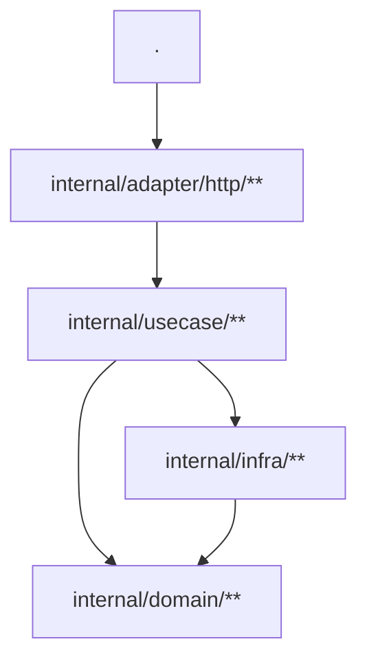
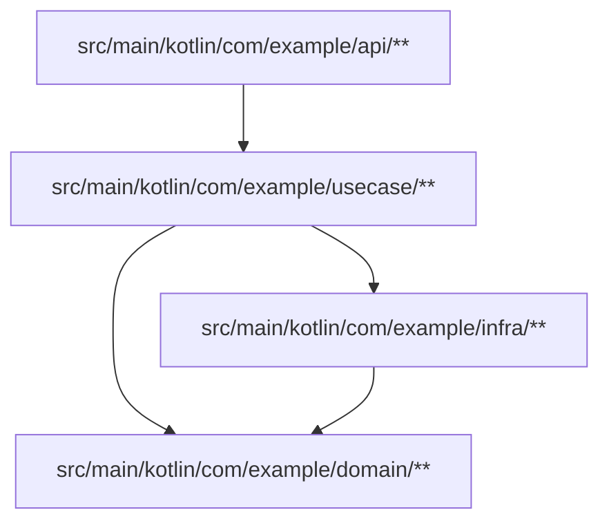
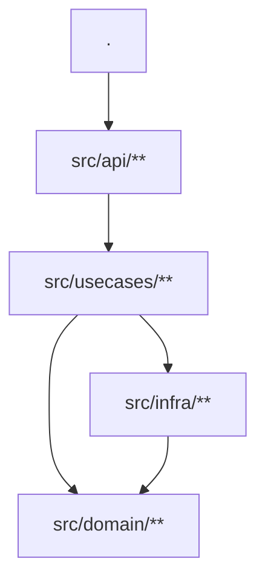
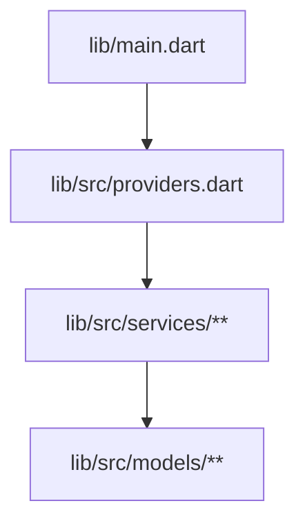
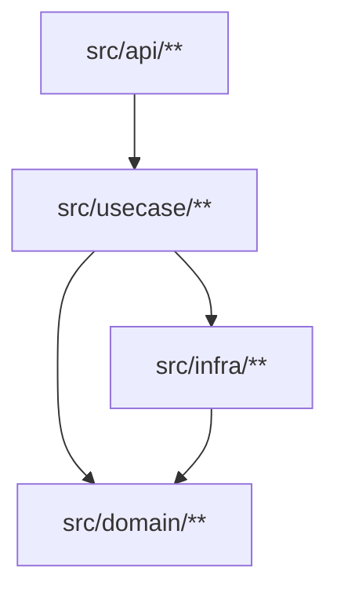

# Strata

**Enforces architecture rules declared in each capsule's `STRATA.md`.**

## Problem

An architecture is only useful if its dependency rules are enforced. Hand-written diagrams rot. Manual review doesn't scale. And a tool that enforces those rules shouldn't be tangled inside a larger codebase — it should be standalone, fast, and language-agnostic.

## Solution

`strata` reads a ```mermaid flowchart block from a `STRATA.md` file, treats nodes as glob-matched groups and edges as the allow-list of cross-node imports, then walks source files to verify every import follows the declared graph.

One diagram. One source of truth. Zero configuration.

## What it is

- A **structural policy check** — enforces the dependency graph declared in `STRATA.md`
- A **standalone binary** — one `go.mod`, no external dependencies, builds to a single executable
- **Language-agnostic** — the core knows nothing about Go, Dart, Kotlin, TypeScript, or Rust. Language-specific parsing lives behind a `Language` interface. Adapters are easy to add.
- **Deterministic** — same files, same diagram, same result. No heuristics, no inference.

## What it is not

- **Not a linter** — no style, naming, or code quality checks
- **Not a general-purpose dependency analyzer** — only enforces rules you declare in `STRATA.md`
- **Not a CI server** — runs locally, exits 0/1, pipe it into whatever workflow you use
- **Not a replacement for `go vet`, `dart analyze`, `clippy`, etc.** — those check code. Strata checks architecture.

## Getting started

### Install

```bash
go install github.com/dariushalipour/strata@latest
```

Or build from source:

```bash
go build -o strata .
```

### Draft

Generate a `STRATA.md` draft from your current dependency reality:

```bash
strata draft /path/to/repo
```

This scans every governed file, resolves every internal import, and writes a comprehensive `STRATA.md` with all nodes and edges. File-level granularity for Dart, directory-level for everything else. If a capsule already has a `STRATA.md`, it's skipped.

This gives you a starting point to prune into your intended architecture.

```bash
strata draft /path/to/repo
drafted: /path/to/repo/myservice/STRATA.md (432 files, 14 nodes, 23 edges)
```

### Add a STRATA.md

You can write one by hand, or use `strata draft` to generate a draft from your existing code.

````markdown

````

This would render a graph like this:


- **Nodes** are `[ID]["<glob>"]` — the glob claims directories (or files) inside the capsule
- **Edges** (`A --> B`) declare that node A may import node B
- `:::endophobic` forbids all same-node imports — files in an endophobic node cannot import any other file in the same node

### How it works

You point `strata` at a directory — usually the root of your repository. It walks the tree, finds every capsule that has both a module manifest (`go.mod`, `pubspec.yaml`, `build.gradle.kts`, `package.json`, or `Cargo.toml`) and a `STRATA.md`, and checks each one. One run covers all capsules. No configuration needed.

**Nested capsules** are supported — if a subdirectory has its own `STRATA.md`, it's treated as an independent capsule. The parent scan skips into that subdirectory, so files are only checked against their own `STRATA.md`, not the parent's. This prevents double-scanning, label collisions, and false positives across capsule boundaries.

```bash
strata /path/to/repo
```

Output (one line per capsule):

```bash
✓ myservice        432 files, 11 nodes, 28 edges
✓ otherpkg         90 files, 11 nodes, 27 edges
```

When a violation is found:

```bash
✗ myservice        432 files, 11 nodes, 28 edges, 1 violation(s)

  internal/adapter/http/handler.go (httpapi) → internal/domain (domain) — not allowed

ℹ Fix: add the missing edge to STRATA.md, or move the file to the correct node.
```

Exit code 0 = clean. Exit code 1 = violations or error.

### JSON output

For CI or tooling, use `--reporter=json` to get machine-parseable output:

```bash
strata check --reporter=json /path/to/repo
```

### Glob syntax

| Glob | Matches |
|---|---|
| `.` | Only the capsule root |
| `internal/domain/**` | `internal/domain` and any subdirectory |
| `internal/infra/*` | Exactly `internal/infra/<one-segment>` |
| `internal/infra/*/**` | `internal/infra/<x>/<y>` and deeper (not the port dir itself) |
| `lib/src/providers.dart` | A single file (Dart only — Go rejects file-shaped globs) |

Most specific match wins. File-shaped globs beat directory-shaped globs.

### Add a language adapter

Implement the `Language` interface:

```go
type Language interface {
    Name() string
    Discover(rootDir string) ([]Capsule, error)
    IsGovernedFile(rel string) bool
    ParseImports(absPath string) ([]string, error)
    ResolveInternalTarget(spec string, c Capsule, fileRel string) (targetDir string, internal bool)
    SupportsFileGlobs() bool
}
```

Then pass your adapter to `strata.Run(rootDir, []strata.Language{yourAdapter{}}, ...)`.

### Kotlin example

Kotlin projects are discovered by looking for `build.gradle.kts` or `build.gradle` alongside a `STRATA.md`. Strata automatically determines the base capsule by scanning source directories (`src/main/kotlin`, `src/commonMain/kotlin`, etc.).

**Project layout:**

```
myapp/
├── build.gradle.kts
├── STRATA.md
└── src/main/kotlin/com/example/
    ├── api/
    │   └── UserController.kt
    ├── usecase/
    │   ├── CreateOrder.kt
    │   └── GetOrderStatus.kt
    ├── domain/
    │   └── Order.kt
    └── infra/
        └── OrderRepository.kt
```

**STRATA.md:**

````markdown

````

This declares that:
- `api` may import `usecase`
- `usecase` may import `domain` and `infra`
- `infra` may import `domain`
- `usecase` is endophobic — use cases cannot import other use cases (e.g. `CreateOrder` cannot call `GetOrderStatus`)
- Any import not listed as an edge is forbidden (e.g. `domain` importing `api`)

**Run:**

```bash
strata /path/to/myapp
```

```bash
✓ myapp            15 files, 3 nodes, 3 edges
```

Kotlin multi-platform projects are supported out of the box. Strata recognizes source sets like `commonMain`, `jvmMain`, `androidMain`, `iosMain`, `darwinMain`, `jsMain`, `nativeMain`, and their corresponding test variants.

### TypeScript example

TypeScript projects are discovered by looking for `package.json` alongside a `STRATA.md`. Strata only governs files under `src/`, and automatically excludes declaration files (`.d.ts`), and tests (`.test.ts`, `.spec.ts`).

Import resolution honors `tsconfig.json` — `paths` aliases, `baseUrl`, and `extends` chains are all resolved. Falls back to `package.json` name matching when no tsconfig is present.

All import patterns are supported: static imports, re-exports, dynamic imports, `require()`, and `import = require()`.

**Project layout:**

```
myapp/
├── package.json
├── tsconfig.json
├── STRATA.md
└── src/
    ├── index.ts
    ├── api/
    │   └── router.ts
    ├── usecases/
    │   ├── create-order.ts
    │   └── get-status.ts
    ├── domain/
    │   └── order.ts
    └── infra/
        └── order-repo.ts
```

**tsconfig.json:**

```json
{
  "compilerOptions": {
    "baseUrl": "src",
    "paths": {
      "@api/*": ["api/*"],
      "@uc/*": ["usecases/*"],
      "@domain/*": ["domain/*"],
      "@infra/*": ["infra/*"]
    }
  }
}
```

**STRATA.md:**

````markdown

````

This declares that:
- `api` may import `usecases`
- `usecases` may import `domain` and `infra`
- `infra` may import `domain`
- `usecases` is endophobic — use cases cannot import other use cases
- Aliases like `@uc/create-order` resolve correctly via tsconfig

**Run:**

```bash
strata /path/to/myapp
```

```bash
✓ myapp            12 files, 5 nodes, 5 edges
```

### Dart example

Dart projects are discovered by looking for `pubspec.yaml` alongside a `STRATA.md`. Strata only governs files under `lib/`, and automatically excludes generated files (`.g.dart`, `.freezed.dart`) and tests (`_test.dart`).

Dart is the only language that supports **file-shaped globs**, letting you pin individual files to nodes.

**Project layout:**

```
myapp/
├── pubspec.yaml
├── STRATA.md
└── lib/
    ├── main.dart
    ├── src/
    │   ├── providers.dart
    │   ├── services/
    │   │   ├── auth_service.dart
    │   │   └── order_service.dart
    │   └── models/
    │       └── user.dart
```

**STRATA.md:**

````markdown

````

This declares that:
- `main.dart` may import `providers.dart`
- `providers.dart` may import anything under `services/`
- `services/` may import `models/`
- `services/` is endophobic — services cannot import each other (e.g. `auth_service.dart` cannot import `order_service.dart`)
- File-shaped globs (`lib/main.dart`) let you govern individual files, not just directories

**Run:**

```bash
strata /path/to/myapp
```

```bash
✓ myapp            8 files, 4 nodes, 3 edges
```

### Rust example

Rust projects are discovered by looking for `Cargo.toml` alongside a `STRATA.md`. Strata only governs `.rs` files under `src/`, and automatically excludes binaries (`src/bin/`), examples (`src/examples/`), integration tests, benches, and `build.rs`.

All import patterns are supported: `use`, `pub use`, scoped visibility (`pub(crate) use`, `pub(super) use`, etc.), `extern crate`, `mod` declarations, grouped imports (`use std::{fmt, io}`), aliased imports (`use Path as Alias`), and wildcard globs (`use path::*`).

**Project layout:**

```
myapp/
├── Cargo.toml
├── STRATA.md
└── src/
    ├── lib.rs
    ├── api/
    │   └── handler.rs
    ├── usecase/
    │   ├── create_order.rs
    │   └── get_status.rs
    ├── domain/
    │   └── order.rs
    └── infra/
        └── order_repo.rs
```

**STRATA.md:**

````markdown

````

This declares that:
- `api` may import `usecase`
- `usecase` may import `domain` and `infra`
- `infra` may import `domain`
- `usecase` is endophobic — use cases cannot import other use cases (e.g. `create_order.rs` cannot call `get_status.rs`)
- Paths like `crate::domain::Order`, `super::Model`, and `self::helpers` all resolve correctly

**Run:**

```bash
strata /path/to/myapp
```

```bash
✓ myapp            6 files, 4 nodes, 4 edges
```

### CI

```yaml
- name: Node architecture check
  run: strata /github/workspace
```

Or integrate it into your dev CLI the way you want — the binary takes one argument (repo root), prints to stdout, and exits 0/1.

## Architecture

```bash
strata/
├── main.go                          # Entry point
├── go.mod                           # Standalone module, zero dependencies
└── internal/
    ├── ui/ui.go                     # Terminal output (✓, ✗, ℹ)
    └── strata/
        ├── language.go              # Language interface + Capsule struct
        ├── graph.go                 # Mermaid parser, glob matching, Graph type
        ├── check.go                 # File walk + rule application
        ├── strata.go            # Run() — orchestrates discovery + checks
        ├── golang/golang.go         # Go adapter (go.mod, go/parser)
        ├── dart/dart.go             # Dart adapter (pubspec.yaml, regex)
        ├── kotlin/kotlin.go         # Kotlin adapter (build.gradle.kts, regex)
        ├── typescript/typescript.go # TS adapter (package.json, tsconfig.json, regex)
        └── rust/rust.go             # Rust adapter (Cargo.toml, regex)
```
