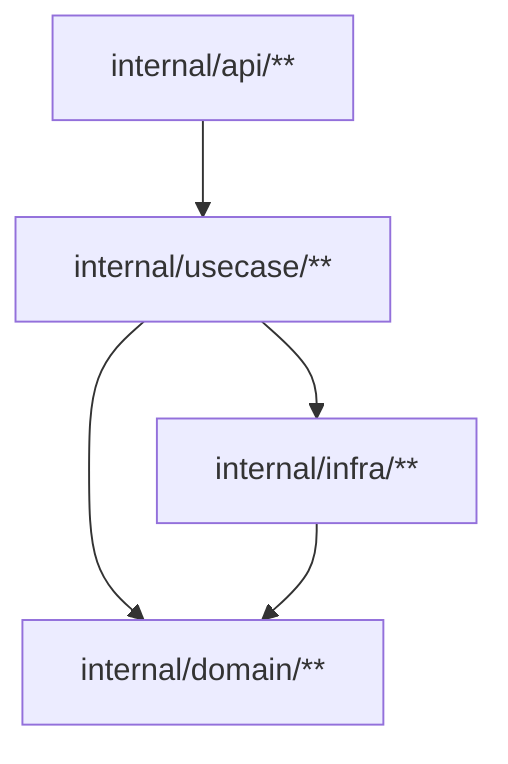

# Baft

Fast, multilingual architecture enforcement from Mermaid diagrams.

Baft reads a Mermaid flowchart from `BAFT.md`, treats nodes as glob-matched slices of a capsule and arrows as the allow-list for cross-node imports, then verifies that your code respects the contract.

One diagram. One source of truth. One fast check.

## Why

Architecture diagrams usually drift into fiction.

- They live in slides, docs, or PR descriptions.
- They stop matching the code a week later.
- Review catches some violations, then misses the next five.

Baft fixes that by making the diagram executable.

## What Baft Is

- A standalone CLI
- Fast architecture checking for real codebases
- Multilingual support for Go, TypeScript, Dart, Kotlin, and Rust
- Deterministic output with no heuristics or inference
- Zero-config capsule discovery from standard project manifests

## What Baft Is Not

- Not a linter
- Not a general-purpose dependency visualizer
- Not a framework or build system
- Not a replacement for language-specific analyzers like `go vet`, `dart analyze`, or `clippy`

## Quick Start

### Install

```bash
go install github.com/dariushalipour/baft@latest
```

Or build from source:

```bash
go build -o baft .
```

### Write a contract

Create `BAFT.md` beside your module manifest.

````markdown

````

GitHub will render that Mermaid block as a diagram:


In this contract:

- `api` may import `usecase`
- `usecase` may import `domain` and `infra`
- `infra` may import `domain`
- `usecase` is `endophobic`, so files in that node may not import other files in the same node

### Run the check

```bash
baft check .
```

Clean output:

```text
✓ myservice (432 files scanned, 847 internal imports checked, graph: 11 nodes, 28 edges)
```

Violation output:

```text
✗ myservice (432 files scanned, 847 internal imports checked, graph: 11 nodes, 28 edges)
    violation [import-not-allowed]: internal/api/handler.go:12:2 (api) → internal/domain (domain) — relation not allowed (add edge in /repo/BAFT.md or move the file)
```

Exit code `0` means clean. Exit code `1` means violations or an error.

### Bootstrap an existing repo

If you do not want to write the first contract by hand:

```bash
baft draft .
```

Baft will generate a `BAFT.md` draft from current dependency reality.

That draft is intentionally too literal. It is a starting point, not the final architecture. You still need to prune edges and merge low-level nodes into the model you actually want to enforce.

## How It Works

1. Baft discovers capsules from standard manifests such as `go.mod`, `package.json`, `pubspec.yaml`, `build.gradle.kts`, and `Cargo.toml`.
2. For each capsule with a `BAFT.md`, it parses the Mermaid flowchart.
3. Node globs claim governed files.
4. Arrows become the allow-list for cross-node imports.
5. Language adapters resolve internal imports and Baft reports every undeclared edge.

Nested capsules are supported. A child directory with its own `BAFT.md` is treated as an independent bounded context, while the parent contract governs cross-context edges between children.

## Contract Model

- **Node:** `nodeId["path/**"]` claims a directory or file-shaped slice of a capsule
- **Edge:** `A --> B` means files in `A` may import files in `B`
- **Self-imports:** allowed by default
- **Endophobic node:** `:::endophobic` disables same-node imports
- **Most specific match wins:** file-shaped globs beat directory-shaped globs

TypeScript and Dart support file-shaped nodes. Go, Kotlin, and Rust require directory-shaped nodes.

## Supported Languages

- Go
- TypeScript
- Dart
- Kotlin, including common multiplatform layouts
- Rust

Baft can scan a multilingual repository in one run as long as each capsule has a supported manifest and a `BAFT.md`.

## Tooling

- `baft check --reporter=json` for machine-readable output
- VS Code extension in [vscode-extension](vscode-extension)
- IntelliJ plugin in [intellij-plugin](intellij-plugin)
- Unsaved editor buffers supported via overlay input in editor integrations

## CI

```yaml
- name: Check architecture
  run: baft check /github/workspace
```

## Docs

- [Manual](docs/manual.md)
- [CLI usage](docs/usage.md)
- [Check command](docs/check-usage.md)
- [Draft command](docs/draft-usage.md)
- [Capsules](docs/concepts/capsule.md)
- [Manifest discovery](docs/concepts/manifest.md)
- [Language notes](docs/concepts/language.md)

## Examples

- [Go](examples/go)
- [TypeScript](examples/typescript)
- [Dart](examples/dart)
- [Kotlin](examples/kotlin)
- [Rust](examples/rust)

## Development

- [Contributing](CONTRIBUTING.md)
- `go test ./...`
```bash
