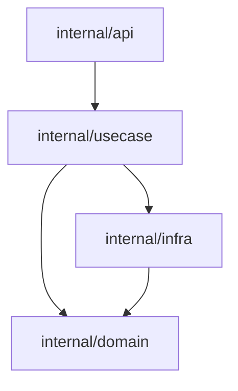

# 🧶 Baft

Fast, multilingual architecture enforcement from Mermaid diagrams.

Baft turns your architecture diagrams into executable contracts. It reads a Mermaid flowchart from `BAFT.md`, maps nodes to code via glob patterns, and verifies that your imports respect the defined boundaries.

One diagram. One source of truth. Zero drift.

## Why

Architecture diagrams usually drift into fiction:

- They live in slides or docs, far from the code.
- They stop matching reality a week after they're drawn.
- Manual PR reviews miss subtle architectural violations.

Baft fixes this by making the diagram the actual enforcement mechanism.

## What Baft Is

- **Executable Architecture:** A standalone CLI that ensures your code matches your design.
- **Multilingual:** Native support for Go, TypeScript, Dart, Kotlin, and Rust.
- **Deterministic:** No heuristics or inference—just strict glob matching and import analysis.
- **Zero-Config:** Automatically discovers capsules from standard project manifests.

## What Baft Is Not

- **Not a linter:** It doesn't care about style, only about structural boundaries.
- **Not a visualizer:** It enforces a diagram you provide; it doesn't generate one from scratch (though it can `dump` one).
- **Not a framework:** It sits on top of your existing build system and language analyzers.

## Baft vs Alternative Architecture Tools

Tools like ArchUnit, Dependency-Cruiser, and language-specific linters are good at enforcing architecture inside their own ecosystems. Baft was built for a different operating model: one contract format, one enforcement engine, and one diagram-driven workflow across a polyglot repository.

| Feature | Traditional architecture tools | Baft |
| --- | --- | --- |
| **Language support** | Usually one language or ecosystem at a time | **Polyglot** across Go, TypeScript, Dart, Kotlin, and Rust |
| **Source of truth** | Rules in code or YAML | **Mermaid diagram** in `BAFT.md` |
| **Enforcement model** | Often blacklist-oriented: define forbidden dependencies | **Default deny**: only declared edges are allowed |
| **Exceptions** | Commonly scattered across inline suppressions or tool-specific config | **Centralized and explicit** in contract files and `.baftignore` |
| **Scaling model** | Frequently centralized in one ruleset per tool | **Nested contracts** for bounded contexts and local ownership |
| **Runtime** | Tied to the host toolchain or language runtime | **Standalone Go binary** |

What that means in practice:

- **What you draw is what you enforce.** The Mermaid diagram is not generated output or secondary documentation; it is the contract Baft checks.
- **The architecture stays tight by default.** If a dependency is not drawn, Baft treats it as forbidden.
- **Exceptions stay visible.** Baft does not support inline source suppressions, so architectural escapes remain reviewable instead of disappearing into random files.
- **Large repos stay composable.** A parent contract can define cross-context boundaries while child contracts enforce local rules inside each module.

## Quick Start

### Install

```bash
go install github.com/dariushalipour/baft@latest
```

Or build from source:

```bash
go build -o baft .
```

### Write a contract

Create `BAFT.md` beside your module manifest.

````markdown

````

GitHub will render that Mermaid block as a diagram:


In this contract:

- `api` may import `usecase`
- `usecase` may import `domain` and `infra`
- `infra` may import `domain`
- `usecase` is `endophobic`, so files in that node may not import other files in the same node

### Run the check

```bash
baft check .
```

Clean output:

```text
✓ myservice (432 files scanned, 847 internal imports checked, graph: 11 nodes, 28 edges)
```

Violation output:

```text
✗ myservice (432 files scanned, 847 internal imports checked, graph: 11 nodes, 28 edges)
    violation [import-not-allowed]: internal/api/handler.go:12:2 (api) → internal/domain (domain) — relation not allowed (add edge in /repo/BAFT.md or move the file)
```

Exit code `0` means clean. Exit code `1` means violations or an error.

### Bootstrap an existing repo

If you do not want to write the first contract by hand:

```bash
baft dump .
```

Baft will generate a `BAFT.md` dump from current dependency reality.

That dump is intentionally too literal. It is a starting point, not the final architecture. You still need to prune edges and merge low-level nodes into the model you actually want to enforce.

## How It Works

1. Baft discovers capsules from standard manifests such as `go.mod`, `package.json`, `pubspec.yaml`, `build.gradle.kts`, and `Cargo.toml`.
2. For each capsule with a `BAFT.md`, it parses the Mermaid flowchart.
3. Node globs claim tracked files.
4. Arrows become the allow-list for cross-node imports.
5. Language adapters resolve internal imports and Baft reports every undeclared edge.

Nested capsules are supported. A child directory with its own `BAFT.md` is treated as an independent bounded context, while the parent contract tracks cross-context edges between children.

## Contract Model

- **Node:** `nodeId["path/to/dir"]` claims files directly in that directory; `nodeId["path/to/dir/&ast;&ast;"]` claims a whole subtree
- **Edge:** `A --> B` means files in `A` may import files in `B`
- **Self-imports:** allowed by default
- **Endophobic node:** `:::endophobic` disables same-node imports
- **Most specific match wins:** file-shaped globs beat directory-shaped globs

**Ignoring Files:** Use a `.baftignore` file (standard gitignore syntax) to exclude files or directories from the check. This is useful for generated code or temporary files that shouldn't be tracked by the contract. Note that inline suppression comments (e.g. `// baft:ignore`) are intentionally not supported to ensure all architectural exceptions remain visible and centralized.

TypeScript and Dart support file-shaped nodes. Go, Kotlin, and Rust require directory-shaped nodes. In all languages, a bare directory glob means the exact directory, not an implicit `/**`.

## Supported Languages

- Go
- TypeScript
- Dart
- Kotlin, including common multiplatform layouts
- Rust

Baft can scan a multilingual repository in one run as long as each capsule has a supported manifest and a `BAFT.md`.

## Tooling

- `baft check --reporter=json` for machine-readable output
- VS Code extension in [vscode-extension](vscode-extension)
- IntelliJ plugin in [intellij-plugin](intellij-plugin)
- Unsaved editor buffers supported via overlay input in editor integrations

## CI

```yaml
- name: Check architecture
  run: baft check /github/workspace
```

## Docs

- [Manual](docs/manual.md)
- [Capsules](docs/concepts/capsule.md)
- [Manifest discovery](docs/concepts/manifest.md)
- [Language notes](docs/concepts/language.md)

## Examples

- [Go](examples/go)
- [TypeScript](examples/typescript)
- [Dart](examples/dart)
- [Kotlin](examples/kotlin)
- [Rust](examples/rust)

## Development

- [Contributing](CONTRIBUTING.md)
- `go test ./...`
