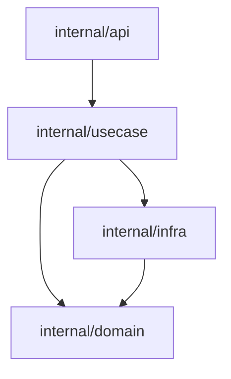
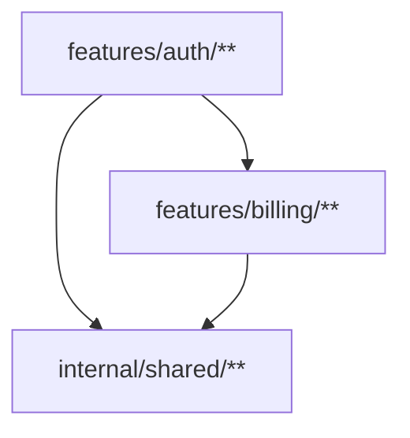
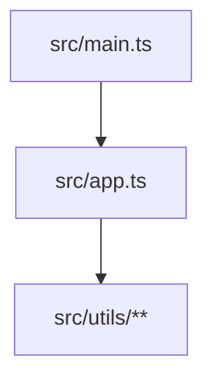

# BAFT.md

A **BAFT.md** file is an executable architecture contract. It defines which files belong to which architectural nodes and which nodes are allowed to import each other. It is written in a Mermaid flowchart format that both humans and tooling can read.

A BAFT.md is optional. A Capsule without a BAFT.md has no architecture rules — files can import anything without violation. A Capsule with a BAFT.md is a tracked Capsule.

---

## The problem

As codebases grow, import relationships become hard to track. Developers add imports that create architectural violations — a domain layer importing from a presentation layer, a use case depending on a specific database driver, a utility module pulling in framework code.

These violations are not syntax errors. The code compiles. The tests pass. But the architecture degrades silently.

BAFT.md solves this by making architecture rules explicit, editable, and enforceable.

---

## Definition

A **BAFT.md** file is a Markdown file containing a single Mermaid `flowchart` block that defines:

- **Nodes** — groups of files identified by glob patterns (`path/**` or `path/file.go`).
  Bare directory nodes such as `path/to/dir` claim only that exact directory; `path/to/dir/**` claims the full subtree.
- **Edges** — directed arrows (`A --> B`) that allow imports from one node to another.
- **Classes** — modifiers like `:::endophobic` that add constraints to nodes.

The file lives at the root of a Capsule (or in a subdirectory for nested capsules). It is discovered on-demand by the `check` and `dump` commands.

---

## What BAFT.md is not

A BAFT.md is not:

- **A build configuration.** It does not declare dependencies, set compiler flags, or configure build tools. It only tracks internal import relationships.
- **A linting rule.** It does not check code style, naming conventions, function signatures, or file contents. It only checks which files import which other files.
- **A package manager config.** It does not resolve, download, or manage external dependencies. External imports are invisible to BAFT.md.
- **A documentation file.** While it serves as living documentation of the architecture, its primary purpose is enforcement. It is parsed by tooling, not just read by humans.
- **A BAFT.md.md file.** The file is named `BAFT.md`, not `architecture.md`, `dependencies.md`, or `graph.md`. The name is the command name, the tool name, and the concept name — it is all the same thing.

---

## What BAFT.md is

A BAFT.md is:

- **An architecture contract.** It declares the structure of the codebase. Edges are permissions — if an edge does not exist, the import is forbidden.
- **A Mermaid flowchart.** The contract is a `flowchart TD` (or `flowchart LR`) block. Nodes are labeled with glob patterns. Edges are `-->` arrows. Classes are `:::modifier` annotations.
- **A live document.** The `dump` command scans source files and generates a BAFT.md from observed imports. The `check` command validates source files against the existing BAFT.md. They work together: dump proposes, check enforces.
- **A per-Capsule file.** Each Capsule has its own BAFT.md. Nested Capsules have their own BAFT.md tracking only their internal imports. The parent Capsule's BAFT.md tracks edges between children.
- **An executable specification.** It is not aspirational documentation that drifts from reality. The tooling reads it, parses it, and enforces it. Violations are reported with file paths, line numbers, and import details.

---

## Format

A BAFT.md file has two parts:

1. **Markdown text** — everything outside the Mermaid block is ignored by tooling. This is where developers write explanations, decisions, and context.
2. **Mermaid flowchart block** — the first fenced ````mermaid` block is parsed. Everything else (subsequent mermaid blocks, code blocks, images) is ignored.

````markdown
<!-- BAFT -- Architecture Contract -->


````

Only the first mermaid block is parsed. If multiple ````mermaid` blocks exist, the parser returns an error.

---

## Nodes

Nodes define which files belong to which architectural group.

**Syntax:** `nodeId["glob_pattern"]`

- **nodeId** — an alphanumeric identifier used in edges (e.g., `api`, `domain`, `usecase`).
- **glob_pattern** — a path pattern matching files or directories.

**Three common shapes:**

- **Exact directory:** `nodeId["path/to/dir"]` — matches files directly in that directory.
- **Subtree directory:** `nodeId["path/to/dir/**"]` — matches that directory and nested directories beneath it.
- **File-shaped:** `nodeId["path/file.ts"]` — matches a single file. Only supported by TypeScript and Dart.

**Specificity:** When a file matches multiple nodes, the most specific match wins. Specificity is scored by:

- Literal path segments: 10 points each
- Single wildcard (`*`): 3 points per segment
- Double wildcard (`**`): 1 point per segment

A file-shaped node (e.g., `lib/main.dart`) always wins over a directory-shaped node that contains it.

**Coverage:** Every tracked file must match at least one node. Files that are not covered are reported as violations: `... is tracked by BAFT.md but matches no node`.

---

## Edges

Edges define allowed import directions.

**Syntax:** `sourceNode --> targetNode`

- **Directional:** `A --> B` allows A to import B, but not B to import A.
- **Non-transitive:** `A --> B --> C` does NOT imply `A --> C`. Every required edge must be explicit.
- **Self-imports:** Allowed by default. A file in node A can import another file in node A unless the node is `:::endophobic`.
- **Chained edges:** `A --> B --> C` is parsed as two separate edges: `A --> B` and `B --> C`.

---

## Classes

Classes add modifiers to nodes.

**Syntax:** `nodeId["glob"]:::classname`

Baft recognizes one class:

- **`:::endophobic`** — forbids files within the same node from importing each other. This enforces a "no internal coupling" rule, useful for keeping use cases, handlers, and services independent.

A node can have multiple classes: `nodeId["glob"]:::endophobic,otherclass`. Unknown classes are stored but have no effect on validation.

---

## Nested Capsules

When a subdirectory contains its own manifest (making it a child Capsule), it may also have its own BAFT.md. This creates a layered tracking model:

**Child scope:**
- The child's BAFT.md tracks only imports where both source and target are within the child directory.
- It cannot reference sibling directories (e.g., `../sibling/**` is forbidden).
- It is responsible for coverage of all tracked files within its directory.

**Parent scope:**
- The parent's BAFT.md can treat child directories as nodes (e.g., `auth["auth/**"]`).
- The parent tracks edges between children (e.g., `billing --> auth`).
- The parent does not check for unmatched files inside children — that is the child's responsibility.

**Cross-scope resolution:** When a file in a child capsule imports a file in a different child capsule, the parent's BAFT.md is consulted. If the parent does not define the edge, it is a violation.

---

## Validation

For the validation model and the full list of contract diagnostics, see [validation.md](validation.md).

In this document, the important point is simpler: `check` uses `BAFT.md` as the source of architecture rules for tracked files. When the contract itself has problems, `check` reports contract diagnostics. When the source files break the declared architecture, `check` reports source-level violations.

---

## The dump command

The `dump` command generates a BAFT.md from observed imports:

1. Walks all tracked files in the Capsule.
2. Parses imports using the language adapter.
3. Resolves internal targets to capsule-relative paths.
4. Maps files to nodes based on directory structure (or file structure for TypeScript/Dart).
5. Builds edges from observed import relationships.
6. Writes a new BAFT.md using the Mermaid format.

**Dump does not merge.** It scans all tracked files and writes a fresh BAFT.md based on observed imports. It does not preserve existing rules, comments, or structure. It is a proposal, not an edit.

**Node granularity:**
- **Go, Kotlin, Rust:** Dumps prefer bare directory nodes such as `internal/domain`. Use `/**` only when you want one node to own a whole subtree.
- **TypeScript, Dart:** Root-level dumps start with merged same-directory `/*.*` nodes and retry with file-shaped nodes only when the merged draft creates a cycle. Scoped or bounded-context dumps still keep root files as file-shaped nodes.

---

## The check command

The `check` command's main question is: **do the actual source files comply with the architecture declared in BAFT.md?**

Contract validation is part of that flow, but it is not the end goal. `check` validates contracts because it needs a trustworthy graph before it can judge the codebase against it.

The `check` command works like this:

1. Discovers all Capsules in the target directory.
2. For each Capsule, finds the root BAFT.md and any scoped contracts in subdirectories.
3. Loads each contract, runs contract validation, and applies language-specific validation.
4. Walks every tracked file and resolves its imports.
5. For each import, determines the tracking scope and checks the edge against the appropriate graph.
6. Aggregates both contract diagnostics and source-level violations into the result.

If a contract cannot be parsed into a usable graph, `check` cannot enforce that contract's rules for the affected scope. If the contract has non-fatal validation problems but still yields a usable graph, `check` may report both contract errors and source-code violations in the same run.

**Per-file check flow:**
1. Baft finds the `BAFT.md` that tracks the file.
2. Baft loads that contract and reuses it for other files in the same scope.
3. Baft matches the source file to its declared node.
4. For each import, Baft resolves the target, determines which contract tracks it, and checks whether that source node is allowed to depend on that target node.
5. For cross-scope imports, Baft walks up to an ancestor contract that tracks both sides of the relation.

---

## Comments

Inside the Mermaid block, `%%` introduces a comment. Comments are ignored by the parser but preserved in the file.

```mermaid
flowchart TD
  %% API layer handles HTTP requests
  api["internal/api/**"]

  %% Domain has no dependencies
  domain["internal/domain/**"]

  api --> domain
`````

---

## Constraints

The following Mermaid features are NOT supported:

- **`subgraph` syntax** — nodes are flat, not grouped into subgraphs.
- **Multiple mermaid blocks** — only the first ````mermaid` block is parsed. Subsequent blocks cause a parse error.
- **`classDef` definitions** — classes are inline only (`:::endophobic`). Custom class definitions are not parsed.
- **Directed graph syntax (`graph`)** — only `flowchart` is supported.

---

## Examples

### Clean architecture

```mermaid
flowchart TD
  presentation["internal/presentation/**"]
  usecase["internal/usecase/**"]:::endophobic
  domain["internal/domain/**"]
  infra["internal/infra/**"]

  presentation --> usecase
  presentation --> domain
  usecase --> domain
  infra --> domain
```

### Feature-based modules



### TypeScript with file-shaped nodes



---

## Relationship to other concepts

| Concept         | Relationship                                                                                                                         |
| --------------- | ------------------------------------------------------------------------------------------------------------------------------------ |
| **Capsule**     | A Capsule may contain a BAFT.md. One BAFT.md per Capsule (or per subdirectory for nested scopes).                                    |
| **Manifest**    | A BAFT.md lives alongside a manifest file. It cannot exist without a manifest, but a manifest can exist without a BAFT.md.           |
| **Language**    | Language adapters determine which files are tracked and how imports are parsed. BAFT.md defines the rules those imports must follow. |
| **.baftignore** | `.baftignore` removes files from visibility before BAFT.md is consulted. Ignored files never reach the architecture contract.        |

---

## Mapping summary

| Ecosystem      | BAFT.md location             | Tracking scope                                 |
| -------------- | ---------------------------- | ---------------------------------------------- |
| Go             | `go.mod` directory           | All `*.go` files in the module                 |
| npm/TypeScript | `package.json` directory     | All `*.ts`, `*.tsx` files in the package       |
| Rust           | `Cargo.toml` (per crate)     | All `*.rs` files under `src/` in the crate     |
| Dart           | `pubspec.yaml` directory     | All `*.dart` files under `lib/` in the package |
| Gradle/Kotlin  | `build.gradle.kts` directory | All `*.kt` files matching source set prefixes  |
