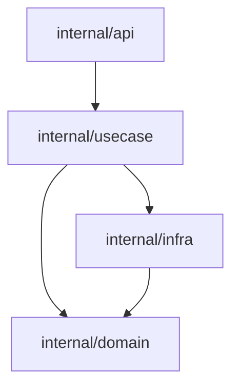
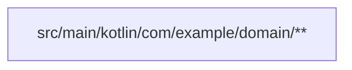
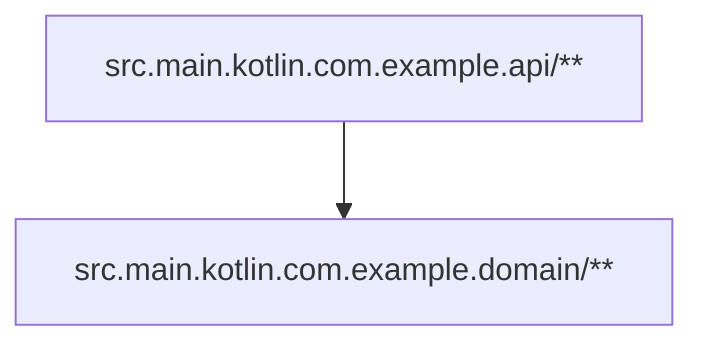
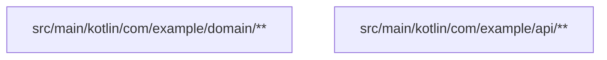
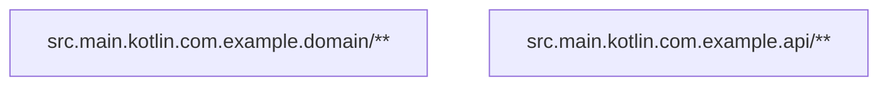
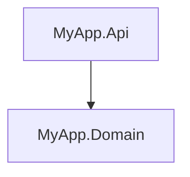
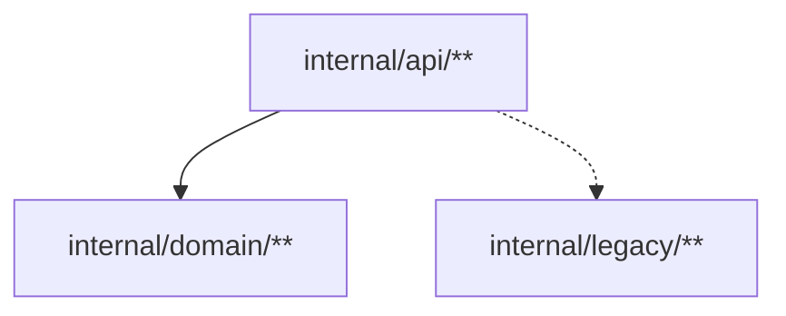
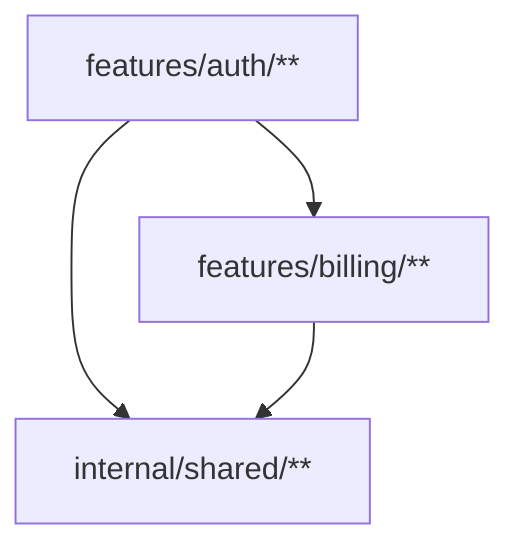
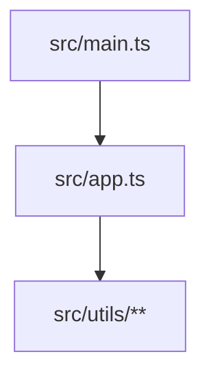

# Contract File

A **contract file** is an executable architecture contract. It defines which files belong to which architectural nodes and which nodes are allowed to import each other. It is written in a Mermaid flowchart format that both humans and tooling can read.

A contract file is optional. A Capsule without a contract file has no architecture rules — files can import anything without violation. A Capsule with a contract file is a tracked Capsule.

---

## The problem

As codebases grow, import relationships become hard to track. Developers add imports that create architectural violations — a domain layer importing from a presentation layer, a use case depending on a specific database driver, a utility module pulling in framework code.

These violations are not syntax errors. The code compiles. The tests pass. But the architecture degrades silently.

A contract file solves this by making architecture rules explicit, editable, and enforceable.

---

## Definition

A **contract file** is a Markdown file containing a single Mermaid `flowchart` block that defines:

- **Nodes** — groups of files identified by glob patterns (`path/**` or `path/file.go`).
  Bare directory nodes such as `path/to/dir` claim only that exact directory; `path/to/dir/**` claims the full subtree.
- **Edges** — directed arrows (`A --> B`) that allow imports from one node to another.
- **Classes** — modifiers like `:::endophobic` that add constraints to nodes.

The file lives at the root of a Capsule (or in a subdirectory for nested capsules). It is discovered on-demand by the `check` and `dump` commands.

---

## What a contract file is not

A contract file is not:

- **A build configuration.** It does not declare dependencies, set compiler flags, or configure build tools. It only tracks internal import relationships.
- **A linting rule.** It does not check code style, naming conventions, function signatures, or file contents. It only checks which files import which other files.
- **A package manager config.** It does not resolve, download, or manage external dependencies. External imports are invisible to the contract.
- **A documentation file.** While it serves as living documentation of the architecture, its primary purpose is enforcement. It is parsed by tooling, not just read by humans.
- **A contract file.** The file is named `BAFT.md`, not `architecture.md`, `dependencies.md`, or `graph.md`. The name is the command name, the tool name, and the concept name — it is all the same thing.

---

## What a contract file is

A contract file is:

- **An architecture contract.** It declares the structure of the codebase. Edges are permissions — if an edge does not exist, the import is forbidden.
- **A Mermaid flowchart.** The contract is a `flowchart TD` (or `flowchart LR`) block. Nodes are labeled with glob patterns. Edges are `-->` arrows. Classes are `:::modifier` annotations.
- **A live document.** The `dump` command scans source files and generates a contract file from observed imports. The `check` command validates source files against the existing contract file. They work together: dump proposes, check enforces.
- **A per-Capsule file.** Each Capsule has its own contract file. Nested Capsules have their own contract file tracking only their internal imports. The parent Capsule's contract file tracks edges between children.
- **An executable specification.** It is not aspirational documentation that drifts from reality. The tooling reads it, parses it, and enforces it. Violations are reported with file paths, line numbers, and import details.

---

## Format

A contract file has two parts:

1. **Markdown text** — everything outside the Mermaid block is ignored by tooling. This is where developers write explanations, decisions, and context.
2. **Mermaid flowchart block** — exactly one fenced ````mermaid` block, which is the contract. Other fenced blocks and images are ignored; a second ````mermaid` block is a parse error.

````markdown
<!-- Baft -- Architecture Contract -->


```mermaid
flowchart TD
  api["internal/api"]
  usecase["internal/usecase"]:::endophobic
  domain["internal/domain"]
  infra["internal/infra"]

  api --> usecase
  usecase --> domain
  usecase --> infra
  infra --> domain
```
````

The block header may be `flowchart <direction>` or `graph <direction>`. Markdown around the block is free text: this is where the reasoning behind the architecture belongs.

---

## Nodes

Nodes define which files belong to which architectural group.

**Syntax:** `nodeId["glob_pattern"]`

- **nodeId** — an alphanumeric identifier used in edges (e.g., `api`, `domain`, `usecase`).
- **glob_pattern** — a path pattern matching files or directories. Wildcards are escaped: a raw `*` in a node label is a parse error, so the subtree glob `path/**` is written `path/&ast;&ast;`. Baft decodes it on load, and `dump` and `restyle` write it that way.

**Three common shapes:**

- **Exact directory:** `nodeId["path/to/dir"]` — matches files directly in that directory.
- **Subtree directory:** `nodeId["path/to/dir/&ast;&ast;"]` — matches that directory and nested directories beneath it.
- **File-shaped:** `nodeId["path/file.ts"]` — matches a single file. Only supported by TypeScript and Dart; every other language reports `file-glob-unsupported`.

**Specificity:** When a file matches multiple nodes, the most specific match wins. Specificity is scored by:

- Literal path segments: 10 points each
- Single wildcard (`*`): 3 points per segment
- Double wildcard (`**`): 1 point per segment

A file-shaped node (e.g., `lib/main.dart`) always wins over a directory-shaped node that contains it.

**Coverage:** Every tracked file must match at least one node. Files that are not covered are reported as `no-node` violations.

---

## Glob Separator

By default, node globs use forward slashes (`/`) as path separators:


```mermaid
flowchart TD
  domain["src/main/kotlin/com/example/domain/&ast;&ast;"]
```

Some ecosystems — notably Kotlin, Java, and Python — use dots (`.`) to separate package segments. The `globSeparator` config directive lets you write globs with any separator character instead of slashes:


```mermaid
flowchart TD
  %% config globSeparator "."

  domain["src.main.kotlin.com.example.domain/&ast;&ast;"]
  api["src.main.kotlin.com.example.api/&ast;&ast;"]

  api --> domain
```

When `globSeparator` is set, every dot that appears between path segments is treated as a separator and normalized to `/` internally. The `check` and `dump` commands then work with the normalized paths transparently.

**Syntax:** `%% config <key> <value>`, where the value may be bare or wrapped in single or double quotes. The keys are `globSeparator` (any non-empty string) and `namespaceMode` (`true` or `false`, any casing). An unknown key or an invalid value is a parse error naming the key.

- The directive must be placed inside the Mermaid block, after the `flowchart` declaration.
- It must be wrapped in `%%` so Mermaid preview tools ignore it.
- The `globSeparator` value can be any non-empty string (single character, multi-character, or emoji).
- The separator is applied to all node globs in the same contract.

**Why the `%%` wrapper?** The `config` keyword is not valid Mermaid syntax. Without `%%`, Mermaid preview tools in your IDE will fail to render the diagram. The `%%` comment makes the line invisible to Mermaid while still being readable by Baft.

**Normalization rules:** A separator character is replaced with `/` only when it appears between two path segment characters (letters, digits, `_`, `-`) or before a wildcard (`*`). Standalone `.` (current directory) and `..` (parent directory) are never replaced, even when `.` is the configured separator.

**Round-trip behavior:** When Baft re-writes a contract (via `dump` amendment), it converts the internal slash-based paths back to the configured separator. So if you add `globSeparator "."` to an existing contract that uses slashes, the next `dump` will rewrite all globs to use dots. `restyle` never rewrites globs; it only refreshes the generated styling block.

**Example — migrating a Kotlin contract to dot notation:**

Before (slashes):

```mermaid
flowchart TD
  domain["src/main/kotlin/com/example/domain/&ast;&ast;"]
  api["src/main/kotlin/com/example/api/&ast;&ast;"]
```

After adding `globSeparator "."` and running `baft dump`:

```mermaid
flowchart TD
  %% config globSeparator "."

  domain["src.main.kotlin.com.example.domain/&ast;&ast;"]
  api["src.main.kotlin.com.example.api/&ast;&ast;"]
```

---

## Namespace Mode

`%% config namespaceMode "true"` switches import resolution from filesystem paths to declared namespaces. Baft indexes the namespace each tracked file declares (`namespace MyApp.Api` in C#, `package com.example.api` in Java and Kotlin), then resolves every `using`/`import` through that index instead of guessing a path from the string.

Use it wherever a file's namespace may differ from its directory. Nodes are then written as namespaces, not paths, and a node claims its whole namespace subtree — `api` below also owns `MyApp.Api.Controllers`:


```mermaid
flowchart TD
  %% config namespaceMode "true"

  api["MyApp.Api"]
  domain["MyApp.Domain"]

  api --> domain
```

Namespace nodes are dotted already, so do not combine `namespaceMode` with `globSeparator "."` — that would rewrite the dots to slashes and nothing would match. File-shaped nodes remain invalid: `file-glob-unsupported` still fires.

---

## Edges

Edges define allowed import directions.

**Syntax:** `sourceNode --> targetNode`

- **Directional:** `A --> B` allows A to import B, but not B to import A.
- **Non-transitive:** `A --> B --> C` does NOT imply `A --> C`. Every required edge must be explicit.
- **Self-imports:** Allowed by default. A file in node A can import another file in node A unless the node is `:::endophobic`.
- **Chained edges:** `A --> B --> C` is parsed as two separate edges: `A --> B` and `B --> C`.
- **Fan-out and fan-in:** `A --> B & C` is `A --> B` plus `A --> C`; `A & B --> C` is `A --> C` plus `B --> C`. Both sides may fan at once.
- **Arrow variants:** `-->`, `--->` and `==>` all declare the same allowed import; their style is decoration. The dotted `-.->` is the one exception — see [Tolerated edges](#tolerated-edges).
- **Labels:** `A -->|reads| B` and `A -- reads --> B` are accepted; the label is discarded.
- **Trailing semicolons** are ignored, so `A --> B;` is valid.

### Tolerated edges

A dotted arrow declares an edge that is allowed but deprecated.

**Syntax:** `sourceNode -.-> targetNode`

Imports along a tolerated edge are reported as `import-tolerated` warnings with severity `warning`. They never fail `check`, which still exits 0. A solid edge stays allowed silently; a missing edge stays an `import-not-allowed` error.

This is the phase-in path for a legacy codebase: declare the architecture you want, mark the edges you have not refactored away yet as dotted, and turn `check` on in CI today. Deleting the dotted arrows one by one is the ratchet.


```mermaid
flowchart TD
  api["internal/api/&ast;&ast;"]
  domain["internal/domain/&ast;&ast;"]
  legacy["internal/legacy/&ast;&ast;"]

  api --> domain
  api -.-> legacy
```

Declaring the same pair both ways (`A -.-> B` and `A --> B`) makes it a plain allowed edge — the solid arrow wins. Chains may mix arrows: `A --> B -.-> C`.

A cycle that runs through a tolerated edge is not reported as a circular dependency: it is the legacy state the contract is ratcheting away from, and every import along that edge is already warned about. A cycle made of solid edges stays an error.

---

## Classes

Classes add modifiers to nodes.

**Syntax:** `nodeId["glob"]:::classname`

Baft recognizes one class:

- **`:::endophobic`** — forbids files within the same node from importing each other. This enforces a "no internal coupling" rule, useful for keeping use cases, handlers, and services independent.

A node can have multiple classes: `nodeId["glob"]:::endophobic,otherclass`. Unknown classes are stored but have no effect on validation.

---

## Nested Capsules

When a subdirectory contains its own manifest (making it a child Capsule), it may also have its own contract file. This creates a layered tracking model:

**Child scope:**
- The child's contract file tracks only imports where both source and target are within the child directory.
- It cannot reference sibling directories (e.g., `../sibling/**` is forbidden).
- It is responsible for coverage of all tracked files within its directory.

**Parent scope:**
- The parent's contract file can treat child directories as nodes (e.g., `auth["auth/&ast;&ast;"]`).
- The parent tracks edges between children (e.g., `billing --> auth`).
- The parent does not check for unmatched files inside children — that is the child's responsibility.

**Cross-scope resolution:** When a file in a child capsule imports a file in a different child capsule, the parent's contract file is consulted. If the parent does not define the edge, it is a violation.

---

## Validation

For the validation model and the full list of contract diagnostics, see [validation.md](validation.md).

In this document, the important point is simpler: `check` uses the contract file as the source of architecture rules for tracked files. When the contract itself has problems, `check` reports contract diagnostics. When the source files break the declared architecture, `check` reports source-level violations.

---

## The dump command

The `dump` command generates a contract file from observed imports:

1. Walks all tracked files in the Capsule.
2. Parses imports using the language adapter.
3. Resolves internal targets to capsule-relative paths.
4. Maps files to nodes based on directory structure (or file structure for TypeScript/Dart).
5. Builds edges from observed import relationships.
6. Writes or amends the contract file in the Mermaid format.

**Where no contract file exists, dump writes one from scratch.** That draft is a proposal, not an edit: it is as literal as the code it read, and you are expected to prune it.

**Where a contract file already exists, dump amends it — it widens it.** Dump runs `check` against the existing contract and adds whatever the code needs to pass: a node for every tracked file that has none, and an allowed edge for every import the contract currently forbids. Existing nodes, edges, node order, `config` directives, and modifiers such as `:::endophobic` are preserved; nothing is ever removed. Unlike `restyle`, amendment rewrites the file from the graph, so prose, headings, the `flowchart` direction and other `%%` comments do not survive it.

That means **`baft dump` on a tracked repo legalizes the imports you have.** An import the contract deliberately forbids becomes an allowed edge, and `check` goes green. Dump names every node and edge it adds so the change is reviewable:

```text
[amended] BAFT.md (+0 nodes, +1 edges)
    + edge api --> infra
```

Use `baft dump --dry-run` to see those additions without writing anything. If an added edge is one your architecture forbids, do not keep it — revert the contract and fix the import instead.

**Node granularity:**
- **C#, Go, Java, Kotlin, Python, Rust:** Dumps prefer bare directory nodes such as `internal/domain`. Use `/**` only when you want one node to own a whole subtree.
- **TypeScript, Dart:** Root-level dumps start with merged same-directory `/*.*` nodes and retry with file-shaped nodes only when the merged draft creates a cycle. Scoped or bounded-context dumps still keep root files as file-shaped nodes.

When the cycle is in the code rather than in the node granularity, no draft can avoid it. Dump writes the cyclic draft anyway — it mirrors the imports you have — and warns on stderr that `baft check` will report the cycle.

---

## The check command

The `check` command's main question is: **do the actual source files comply with the architecture declared in the contract file?**

Contract validation is part of that flow, but it is not the end goal. `check` validates contracts because it needs a trustworthy graph before it can judge the codebase against it.

The `check` command works like this:

1. Discovers all Capsules in the target directory.
2. For each Capsule, finds the root contract file and any scoped contracts in subdirectories. The search never climbs above the checked directory, so a stray `BAFT.md` in a parent directory is never adopted.
3. Loads each contract, runs contract validation, and applies language-specific validation.
4. Walks every tracked file and resolves its imports.
5. For each import, determines the tracking scope and checks the edge against the appropriate graph.
6. Aggregates both contract diagnostics and source-level violations into the result.

If a contract cannot be parsed into a usable graph, `check` cannot enforce that contract's rules for the affected scope. If the contract has non-fatal validation problems but still yields a usable graph, `check` may report both contract errors and source-code violations in the same run.

**Per-file check flow:**
1. Baft finds the contract file that tracks the file.
2. Baft loads that contract and reuses it for other files in the same scope.
3. Baft matches the source file to its declared node.
4. For each import, Baft resolves the target, determines which contract tracks it, and checks whether that source node is allowed to depend on that target node.
5. For cross-scope imports, Baft walks up to an ancestor contract that tracks both sides of the relation.

---

## Comments

Inside the Mermaid block, `%%` introduces a comment. Comments are ignored by the parser, and `check` and `restyle` leave them alone. `dump`'s amendment does not: it rewrites the file from the graph, so comments — and any prose around the block — are lost.

```mermaid
flowchart TD
  %% API layer handles HTTP requests
  api["internal/api/&ast;&ast;"]

  %% Domain has no dependencies
  domain["internal/domain/&ast;&ast;"]

  api --> domain
`````

---

## Constraints

What the parser accepts and what it refuses:

- **`subgraph` syntax** — nodes are flat, not grouped into subgraphs.
- **Multiple mermaid blocks** — a second ````mermaid` block is a parse error.
- **`graph` and `flowchart` headers** — both accepted, in any direction (`TD`, `LR`, `RL`, `BT`).
- **`classDef`, `style`, `linkStyle`** — tolerated and skipped. Classes are inline only (`:::endophobic`); custom class definitions carry no meaning.
- **Generated styling** — the `style`/`linkStyle` tail written by `dump --color-palette` and `restyle` is machine-managed. Regenerate it with `baft restyle`; do not hand-edit it.
- **Undirected, invisible and bidirectional links** — `A --- B`, `A === B`, `A ~~~ B`, `A --o B`, `A --x B` and `A <--> B` are rejected by name; an edge must point one way.
- **Raw `*` in a node glob** — a parse error. Escape every wildcard as `&ast;` (`&#42;` is also read): `api["internal/api/&ast;&ast;"]`.
- **Node ids** — must match `[A-Za-z_][A-Za-z0-9_]*`. They are kept verbatim, so they are also what diagnostics report.

---

## Examples

### Clean architecture

```mermaid
flowchart TD
  presentation["internal/presentation/&ast;&ast;"]
  usecase["internal/usecase/&ast;&ast;"]:::endophobic
  domain["internal/domain/&ast;&ast;"]
  infra["internal/infra/&ast;&ast;"]

  presentation --> usecase
  presentation --> domain
  usecase --> domain
  infra --> domain
```

### Feature-based modules


```mermaid
flowchart TD
  auth["features/auth/&ast;&ast;"]
  billing["features/billing/&ast;&ast;"]
  shared["internal/shared/&ast;&ast;"]

  auth --> shared
  billing --> shared
  auth --> billing
```

### TypeScript with file-shaped nodes


```mermaid
flowchart TD
  app["src/app.ts"]
  main["src/main.ts"]
  utils["src/utils/&ast;&ast;"]

  main --> app
  app --> utils
```

---

## Relationship to other concepts

| Concept         | Relationship                                                                                                                         |
| --------------- | ------------------------------------------------------------------------------------------------------------------------------------ |
| **Capsule**     | A Capsule may contain a contract file. One contract file per Capsule (or per subdirectory for nested scopes).                                    |
| **Manifest**    | A contract file lives alongside a manifest file. It cannot exist without a manifest, but a manifest can exist without a contract file.           |
| **Language**    | Language adapters determine which files are tracked and how imports are parsed. The contract file defines the rules those imports must follow. |
| **.baftignore** | `.baftignore` removes files from visibility before the contract file is consulted. Ignored files never reach the architecture contract.        |

---

## Mapping summary

| Ecosystem      | Contract file location       | Tracking scope                                 |
| -------------- | ---------------------------- | ---------------------------------------------- |
| Go             | `go.mod` directory           | All `*.go` files in the module                 |
| npm/TypeScript | `package.json` directory     | All `*.ts`, `*.tsx` files in the package       |
| Rust           | `Cargo.toml` (per crate)     | All `*.rs` files under `src/` in the crate     |
| Dart           | `pubspec.yaml` directory     | All `*.dart` files under `lib/` in the package |
| Java/Kotlin    | `build.gradle.kts`, `build.gradle`, or `pom.xml` directory | All `*.java` and `*.kt` files in source sets |
| Python         | `pyproject.toml`, `setup.py` directory | All `*.py` files under the package root |
| C#             | `*.csproj` directory         | All `*.cs` files in the project                |
