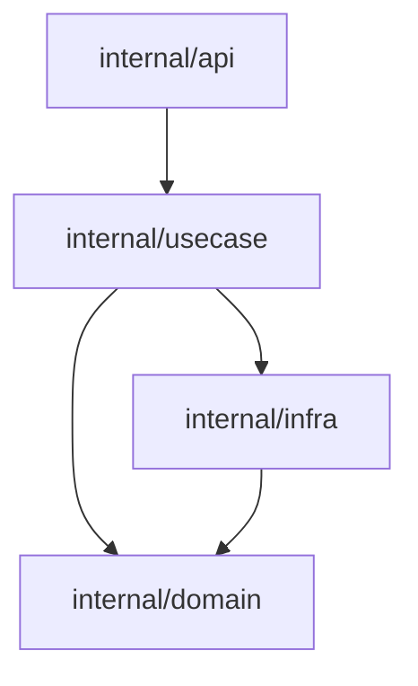

# BAFT.md Manual: Working in BAFT-Tracked Code

If you are editing code in a repository containing a `BAFT.md` file, this guide explains how the architecture is enforced and how to work with it.

**Local command:** `baft manual`

`BAFT.md` is an **executable architecture contract**. It defines which files belong to which architectural nodes and which nodes are allowed to import each other. It serves as both live documentation and automated enforcement.

---

## 🤖 AI Agent Fast Path

When modifying code in a BAFT-tracked repository, follow these steps to avoid violations:

1. **Identify the Contract:** Find the nearest `BAFT.md` tracking the file you are editing.
2. **Map the Source:** Match the source file's path against the node globs in the Mermaid diagram.
3. **Map the Target:** For every internal import, identify which node the target file belongs to.
4. **Verify the Edge:** The import is allowed ONLY if:
   - The source and target are in the same node (and the node is NOT marked `:::endophobic`).
   - There is an explicit edge in the diagram: `sourceNode --> targetNode`.
5. **Resolve Violations:** If an import is forbidden:
   - **Move the file** to a node that already has the required dependency.
   - **Add the edge** to `BAFT.md` if the architecture should be updated.
   - **Refactor** to use an allowed intermediary.
6. **Verify:** Run `baft check` before submitting changes.

---

## Understanding BAFT.md

### Core Concepts

- **Capsule:** A supported project root (identified by a manifest like `go.mod` or `package.json`).
- **Nodes:** Groups of files defined by glob patterns.
- **Edges:** Arrows (`-->`) that define allowed import directions.
- **Endophobicity:** A modifier (`:::endophobic`) that forbids files within the same node from importing each other.

### Minimal Example

**What this means:**

- Files in `api` may import `usecase`.
- Files in `usecase` may import `domain` and `infra`, but **cannot** import other files in `usecase`.
- Files in `infra` may import `domain`.

### Format & Syntax

- **Mermaid Block:** Only the first fenced `mermaid` flowchart block is parsed. Everything else is ignored.
- **Comments:** Use `%%` for comments inside the Mermaid block.
- **Escaping:** Use `&ast;` for literal asterisks (`*`) inside labels.
- **Constraints:** `subgraph` syntax is not supported.
- **Generated styling:** `baft dump --color-palette ...` and `baft restyle --color-palette ...` append Mermaid `style` and `linkStyle` lines after the node and edge declarations. `vibrant`, `muted`, and `mono` define 16 canonical colors; graphs with more than 16 nodes reuse colors in deterministic node order. `none` skips palette coloring and only emits dashed styling for `:::endophobic` nodes.

### Node Definitions

**Syntax:** `nodeId["path/to/dir"]` or `nodeId["path/to/dir/**"]` (directory-shaped), or `nodeId["path/file.go"]` (file-shaped).

- **Specificity:** The most specific match wins. File-shaped globs take precedence over directory-shaped globs.
- **Coverage:** Every tracked file must match at least one node. Unmatched files are reported as violations.
- **Directory semantics:** `path/to/dir` claims files directly in that directory. `path/to/dir/**` claims the whole subtree rooted there.
- **Language Support:**
  - **TypeScript, Dart:** Support both file-shaped and directory-shaped nodes.
  - **Go, Kotlin, Rust:** Support directory-shaped nodes only. Using a file-shaped node (e.g., `handler["path/handler.go"]`) in these languages produces a validation error: `file-shaped nodes require a language that supports file globs`.

### Ignoring Files with `.baftignore`

If some files should be completely invisible to Baft (e.g., generated code, build artifacts, or temporary files), use a `.baftignore` file.

- **Syntax:** Uses standard `.gitignore` syntax (including negations with `!`).
- **Precedence:** `.baftignore` files are processed alongside `.gitignore`. If both exist at the same level, `.baftignore` takes precedence.
- **Hierarchy:** Like git, `.baftignore` files can be nested. A `.baftignore` in a subdirectory applies to that directory and its children.
- **Use Case:** Use this to exempt files that are not part of your architectural design. 
- **No inline suppression:** Baft intentionally does not support inline suppression comments (e.g. `// baft:ignore`) inside source files to keep architecture visibility centralized.

### Edges & Rules

**Syntax:** `nodeA --> nodeB`

- **Directional:** `A --> B` allows A to import B, but not vice versa.
- **Non-Transitive:** `A --> B --> C` does **not** imply `A --> C`.
- **Self-Imports:** Allowed by default unless the node is `:::endophobic`.

---

## Advanced Workflow

### Nested Capsules (Bounded Contexts)

A child directory with its own `BAFT.md` is treated as an independent bounded context.

**Child Scope:**

- Only evaluates imports where both source and target are within the child directory.
- Cannot reference sibling directories (e.g., `../sibling/**` is forbidden).

**Parent Scope:**

- The parent `BAFT.md` can treat child directories as nodes (e.g., `auth["auth/**"]`).
- The parent tracks edges _between_ children (e.g., `billing --> auth`).
- The parent does not check for unmatched files inside children; that is the child's responsibility.

### Handling Violations

Common error messages:

- `... is tracked by BAFT.md but matches no node`: The file isn't covered by any glob in `BAFT.md`.
- `... imports ... - target matches no node`: The imported file isn't part of the contract.
- `... imports ... - A -> B not allowed`: The import violates the defined edges.
- `... cross-directory edge not declared in parent`: A violation occurring between nested capsules.

**Exit Codes:** `0` (Success), `1` (Violation/Error).

## Styling Workflow

- **`baft dump --color-palette <name>`** writes a styled contract while preserving the same node and edge discovery rules as unstyled dump output.
- **`baft restyle --color-palette <name>`** rewrites the generated Mermaid styling block for every `BAFT.md` under the selected root without changing nodes, edges, or inline semantic classes such as `:::endophobic`.
- **`baft restyle --stdin --path <file> --color-palette <name>`** restyles one in-memory `BAFT.md` from stdin and writes the result to stdout. Editor integrations use this mode for Format Document and Reformat Code so only the active contract changes.
- **Edge colors:** Each edge is styled with the same stroke color as its source node.
- **Endophobic nodes:** `:::endophobic` remains the semantic marker in the contract. Generated styling renders those nodes with a dashed stroke rather than a generated Mermaid class.

---

## Agent Guardrails

- **No Implicit Edges:** Do not add imports just because they compile; check the contract.
- **Claim New Files:** Ensure every new file is covered by a node glob.
- **Scope Respect:** Authorize sibling imports in the **parent** contract, never the child.
- **Atomic Updates:** Update `BAFT.md` in the same commit as the code changes that require it.
- **Final Check:** Always run `baft check` before finishing.
