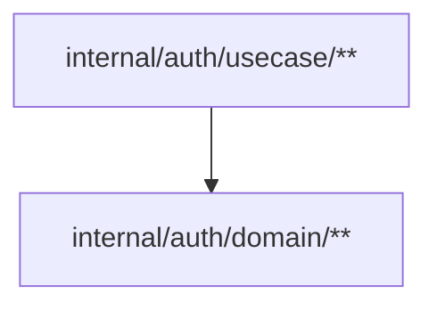

<!-- STRATA — Architecture Contract: auth bounded context -->
<!-- auth/** is governed by this file. -->
<!-- Cross-context edges from billing or api are governed by internal/STRATA.md -->

```mermaid
flowchart TD
  domain["internal/auth/domain/**"]
  usecase["internal/auth/usecase/**"]
  usecase --> domain
```
