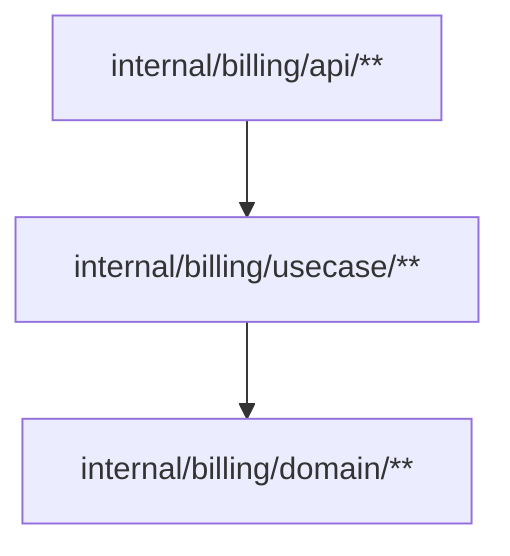

<!-- BAFT — Architecture Contract: billing bounded context -->
<!-- billing/** is governed by this file. -->
<!-- Cross-context edges from api or notifications are governed by internal/BAFT.md -->

