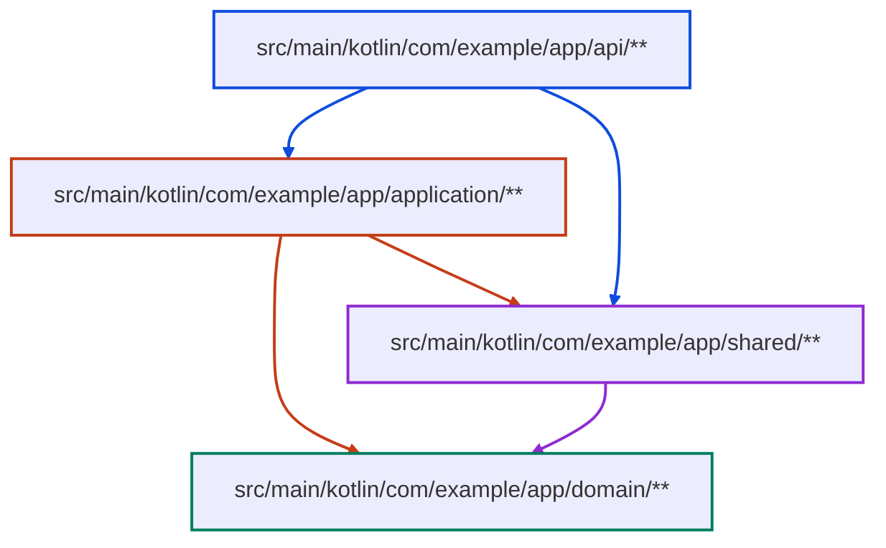

<!-- BAFT architecture contract: edit nodes and edges to change allowed imports. -->
<!-- If BAFT is new to you, run `baft manual`. -->
<!-- Nodes claim file globs. Arrows allow imports. `:::endophobic` forbids same-node imports. -->
<!-- Validate with `baft check`. Refresh generated styling with `baft restyle`. -->

