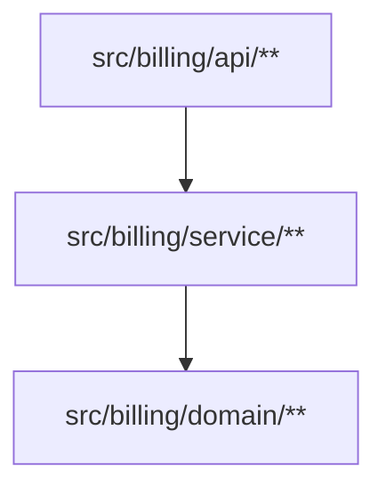

<!-- BAFT — Architecture Contract: billing bounded context -->
<!-- AI agents and developers working in this codebase: if BAFT is unfamiliar, run `baft manual` to study the contract format and rules. -->
<!-- billing/** is tracked by this file. -->
<!-- Cross-context edges from api or notifications are tracked by src/BAFT.md -->

