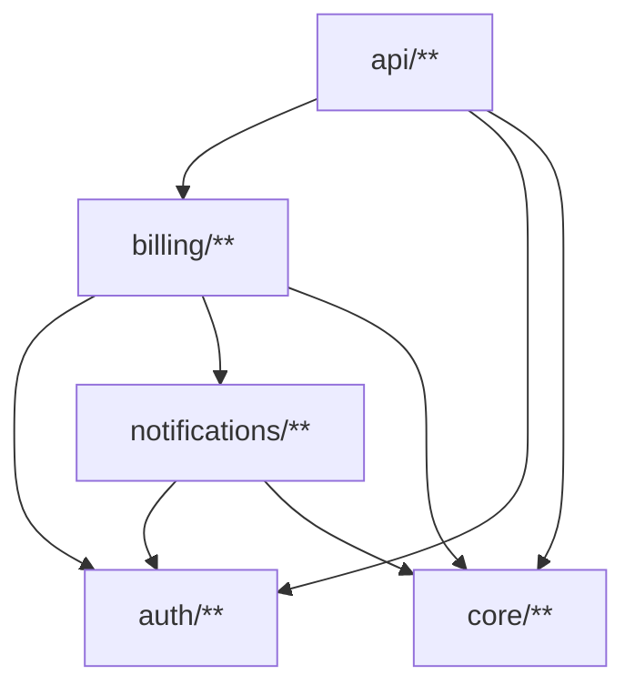

<!-- BAFT — Architecture Contract: Human-maintained. Edit this file to change rules. -->
<!-- AI agents and developers working in this codebase: if BAFT is unfamiliar, run `baft manual` to study the contract format and rules. -->
<!-- Layers & allowed imports are both documentation and enforcement. -->
<!-- Run `baft` for the complete specification. -->
<!-- Install: `go install github.com/dariushalipour/baft@latest` -->
<!-- (ensure ~/go/bin is in your PATH) -->

