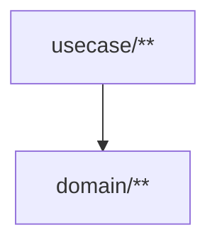

<!-- BAFT — Architecture Contract: notifications bounded context -->
<!-- AI agents and developers working in this codebase: if BAFT is unfamiliar, run `baft manual` to study the contract format and rules. -->
<!-- notifications/** is governed by this file. -->
<!-- Cross-context edges from billing or api are governed by src/BAFT.md -->

